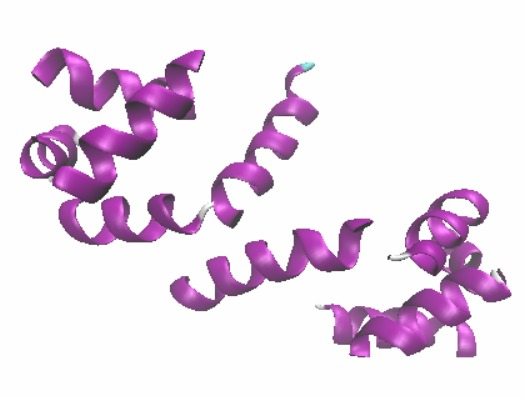

Protein 2A8F was selected from the Protein Data Bank. A literature review was made about this protein and information was given about its general properties. With the VMD (Visual Molecular Dynamics) program, hydrogen atoms that are not found in crystal structures were added to the protein structure, and PSF (protein structure file) and PDB (protein coordinate file) files were created. A water box large enough to contain the created system was created and ions were added to meet the desired conditions. Using the NAMD (Nanoscale Molecular Dynamics) program, the simulation of the system, which was prepared with a length of 5 ns for each simulation, was carried out for temperatures of 300K and 400K. The obtained simulation results were analyzed and the kinetic energy, pressure, volume and temperature changes of the system were plotted over time. Root mean square deviation (RMSD) values of the systems were calculated. Then, by calculating the RMSD value for each amino acid, the mobile regions of the protein were determined and visualized.
 

 <a href="../images/proteinprojesi.pdf" download>Click on</a> to download it:

