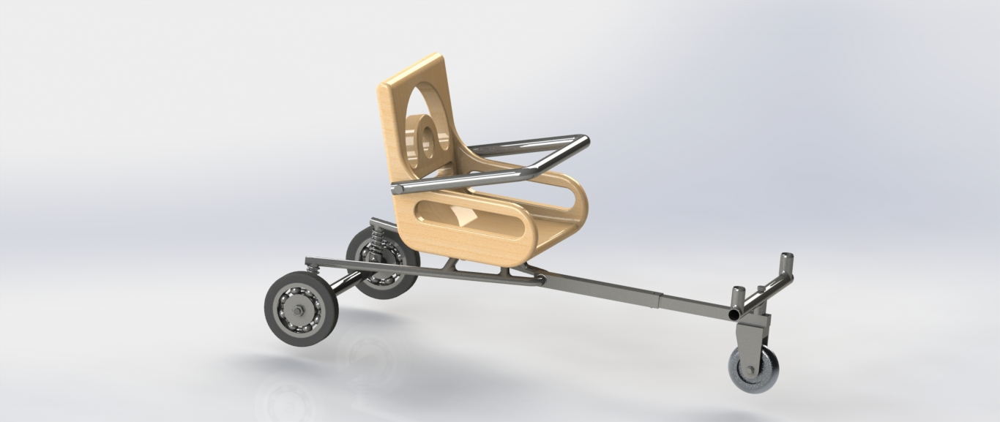

Developed a structured design approach for a cart rower by defining relevant engineering standards, conducting brainstorming and concept development, and analyzing existing designs. Proposed a primary design solution along with alternative concepts and established a detailed project timeline to support systematic development and implementation.

 

 

Technical drawing of cart rower:
<embed src="../images/cartrowermontaj.PDF" width="800px" height="500px" />

 

 <a href="../images/cartrowerreport.pdf" download>Click on</a> to download project report.

 
 
 
 
 
 
 
 
 
 
 
 
 
 
 
 
 
 
 
 
 
 
 

  
  
  
  
